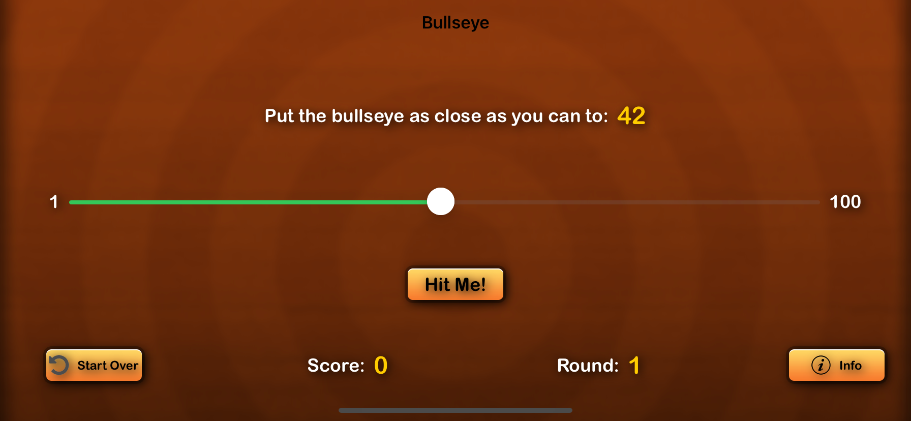
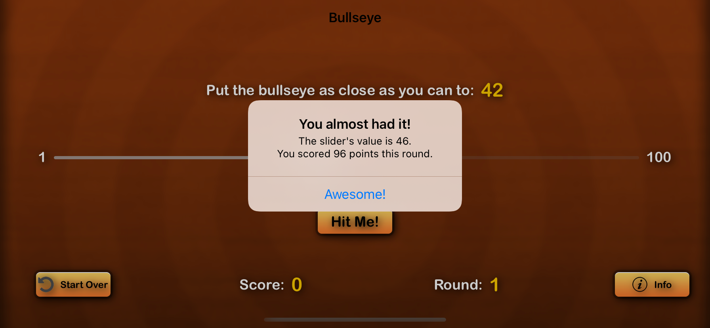
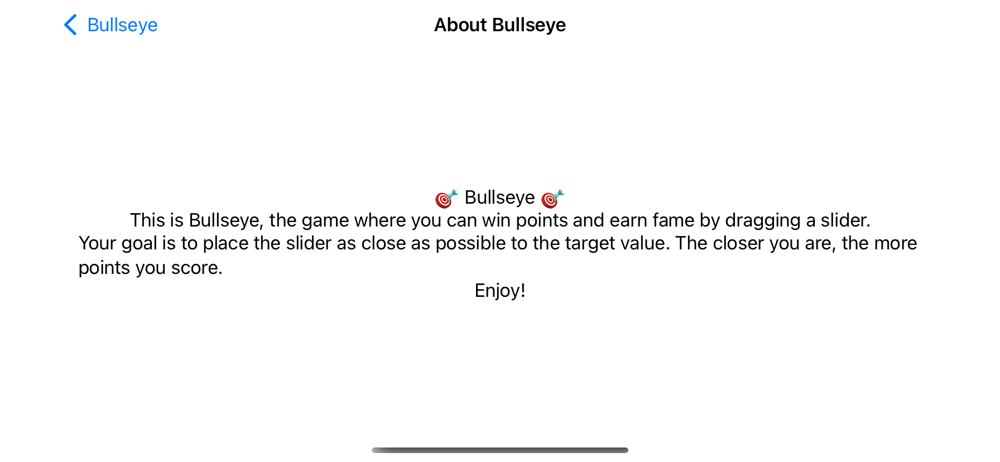

# BullsEye
BullsEye is a  game made using SwiftUi for iOS users.Your goal is to place the slider as close as possible to the target value. The closer you are, the more points you score. 

     
     
     
     

 

